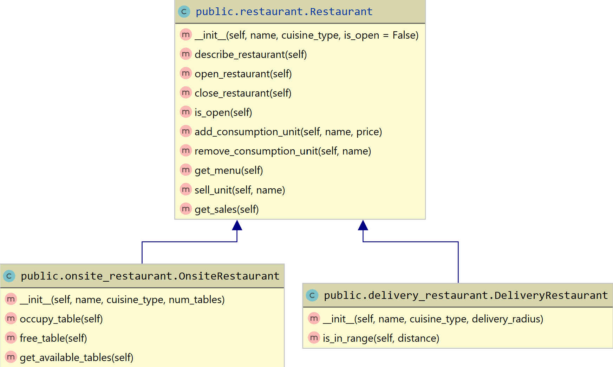

## Simple Inheritance
In this task you will build a simple object-oriented hierarchy for restaurant types as per the following UML diagram.

**Note**: the class names above correspond to the folderpaths, i.e. `public/onsite_restaurant.py` with class `OnsiteRestaurant`.
Also instance variables are not indicated. You should figure out what kind of instance variables you need from the description below.

The root of the hierarchy is the base class `Restaurant`. 
This class provides basic functionality that pertain to all Restaurant types.
Instances of `Restaurant`, Restaurants are initiated with a `name` and the `cuisine_type` offered (both strings).
`is_open` is an optional parameter that defines whether the restaurant is already open at time of initialization.
The class provides the following methods:
- `describe_restaurant()` returns a description of the restaurant as a string, containing the restaurant's `name` and the `cuisine_type`.
- `open_restaurant()`, sets a dedicated private instance variable to `True`.
- `close_restaurant()`, sets this instance variable to `False`.
- `is_open()` returns this instance variable. 
- `add_consumption_unit(name, price)` adds an offer with a `name` and corresponding `price` to the restaurants menu.
- `remove_consumption_unit(name)` removes the offer `name` from the menu.
- `get_menu()` should return a dictionary mapping unit `name`s to `price`s.
Make sure that `get_menu()` returns a copy, such that the dictionary cannot be adapted from the outside. 
Use `copy.deepcopy(dictionary)` for this (import already provided).
- `sell_unit(name)` adds the price of the sold unit `name` to an instance variable for sales.
If the restaurant is not open already, this should raise a `Warning()`.
- `get_sales()` returns the sum of all the prices of sold units.

`Restaurant` has two direct subtypes, `OnsiteRestaurant` and `DeliveryRestaurant`. 
 While both are restaurants, they handle specific logic that goes further than the one from the `Restaurant` class.
 
 
`OnsiteRestaurant`s are initiated with an additional `num_tables` parameter, the number of tables where customers can be seated on-site.
These type of restaurants need the following two methods:
- `occupy_table()` subtracts `1` from the restaurants `available_tables`. If there are no more
tables available, a `Warning()` should be raised.
- `free_table()` adds `1` to the restaurants `available_tables`. If there are as many tables available as
the restaurant total `num_tables` a `Warning()`should be raised.

`DeliveryRestaurants`s are initiated with a maximum `delivery_radius` in kilometers
These restaurants only provide the method `is_in_range(distance)` which checks whether the delivery `distance` lies 
within the `delivery_radius`. If it does `True` must be returned, if not, `False` must be returned.

#### Hints
- Check the examples from `public/script.py` to see how the classes work.
- Make sure to use private instance variables whenever possible.
- Don't forget to call `super()` where accurate.
- All state must be contained within the classes. Do not store information in global variables or in class variables.
 It must be possible to use multiple instances of the classes in parallel without suffering from side effects.

**Note:** The provided files define the signatures of various classes and functions. 
Do not change these signatures or the automated grading will fail.

**Note:** You can freely edit `script.py`, which is not relevant for the grading. We also strongly encourage you 
to add more tests to the public test suite `test_cars.py`.

**Note:** You have to submit four files as solution: `delivery_restaurant.py`, `onsite_restaurant.py` and `restaurant.py`.

**Note:** The UML diagram above has been created with Pycharm's integrated UML diagram generation function.
Check this [Link](https://waterprogramming.wordpress.com/2015/07/29/pycharm-as-a-python-ide-for-generating-uml-diagrams/) 
if you are interested.