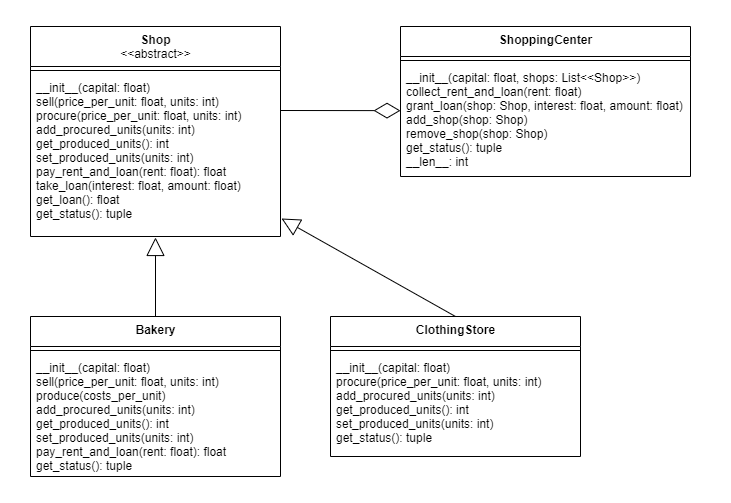

In this task you will implement the classes in the following
UML diagram. The functions signatures in the code are according to this UML
diagram.

The `Shop` is an *abstract base class* and most of the functions are already
implemented. The functions `add_procured_units`, `get_produced_units` and 
`set_produced_units` should be implemented as abstract methods. You should 
read the implemented functions and implement the correct adaptations for these
abstract methods in the subtypes. `Shop` has two 
subtypes `Bakery` and `ClothingStore`.

A `Bakery` is initiated with a starting `capital` it can work with. It can 
`procure` dough, produce `bread` out of the `dough` and finally sell the `bread`.
Furthermore, a `Bakery` can also `take_loan` and `pay_rent_and_loan`.
When a `Bakery` `produce`s bread out of dough, it converts all the dough to bread
and pays the cost for that. If the `Bakery` does not have enough capital to
convert all the dough to bread, it converts as many doughs to bread as it can afford.
Additionally, a `Warning` should be raised in this case. For improving the sale 
on the bread the `Bakeries` have a discount on the `price_per_unit` of 25%. 
As the `Bakeries` are subsidized they only have to pay 80% of the `rent` in the
`pay_rent_and_loan` function. The function `get_status` is a helper function to
check the status of `Bakery` and should return a `tuple`
with the following elements in this **order**: capital, loan, interest, 
initial_loan_amount, dough, bread. These are the states a `Bakery` should have.
Have a look at the following example to get a better understanding of the 
`Bakery` class.

    b = Bakery(10000)
    b.procure(1, 1000) 
    b.get_status() # 9000, 0, 0, 0, 1000, 0
    b.produce(1)
    b.get_status() # 8000, 0, 0, 0, 0, 1000
    b.sell(4, 1000)
    b.get_status() # 11000, 0, 0, 0, 0, 0
    b.pay_rent_and_loan(1000)
    b.get_status() # 10200, 0, 0, 0, 0, 0

A `ClothingStore` is initiated with a starting `capital` it can work with. It can 
`procure` `clothing_pieces` and sell these `clothing_pieces`.
Furthermore, a `ClothingStore` can also `take_loan` and `pay_rent_and_loan`.
A `ClothingStore` can get a quantity discount of 20% when it procures more than 
10 units. The function `get_status` is a helper function to
check the status of `Bakery` and should return a `tuple`
with the following elements in this **order**: capital, loan, interest, 
initial_loan_amount, clothing_pieces. These are the states a `ClothingSore` 
should have. Have a look at the following example to get a better understanding 
of the `ClothingStore` class.

    c = ClothingStore(10000)
    c.procure(1, 1000) 
    c.get_status() # 9200, 0, 0, 0, 1000
    c.sell(4, 1000)
    c.get_status() # 13200, 0, 0, 0, 0
    c.pay_rent_and_loan(1000)
    c.get_status() # 13000, 0, 0, 0, 0

A `ShoppingCenter` is initiated with a starting `capital` and `Shop`s. The shops
should be passed as a `list` of shops. As a `Bakeries` and `Clothing_Stores` are 
of type Shop, both of them count as `Shop`. If a `ShoppingCenter` is initialized
without a shop, a `Warning` should be raised. A `ShoppingCenter` can add a single 
shop with `add_shop` and remove a single shop with `remove_shop`. `Remove_shop`
should return the `Shop` which was removed. 

A `ShoppingCenter` can also grant
a loan with `grant_loan` and collect rent and loan with `collect_rent_and_loan`.
The function `grant_loan` has the following three parameters: shop, interest and 
amount. If a `ShoppingCenter` tries to grant a loan to a `Shop` which does not
belong to the `ShoppingCenter`, `grant_loan` should raise a `Warning`. If the 
capital of the `ShoppingCenter` is not enough to grant the amount of the loan,
`grant_loan` should also raise a `Warning`. When a loan is granted, the amount of
the loan should be deducted from capital of the company and should be added to
the loan state of the Shop. You should use `take_loan` for this. A `ShoppingCenter`
also keeps track of its debtors within a list.
The `collect_rent_and_loan` has one parameter the rent which should be collected
from the individual stores of the `ShoppingCenter` and added to the 
`ShoppingCenter`'s capital. The function `pay_rent_and_loan` of `Shop` returns
the amount a shop should pay in rent and loan and helps to fulfill the requirements
of the `collect_rent_and_loan`. If the loan of a `Shop` hit `0` it should be
removed from the list of debtors in the function `collect_rent_and_loan`.

Also implement the __len__ function which should return the number of shops 
a shopping center has.

The function `get_status` is a helper function to
check the status of a `ShoppingCenter` and should return a `tuple`
with the following elements in this **order**: capital, shops, debtors. Shops 
and debtors should also be tuples which contain `Shop`s. An example of a return
for `get_status` could be the following:
`(10000, (bakery1, bakery2, clothing_store1), (bakery1, clothing_store1))`.
These are the states a `ClothingSore` 
should have. Have a look at the following example to get a better understanding 
of the `ShoppingCenter` class.

    bakery = Bakery(1000)
    s = ShoppingCenter(10000, [bakery_two]) # (capital, shops, debtors) = (10000, (bakery,), ())
    clothing_store = ClothingStore(2000)
    s.add_shop(clothing_store) # (10000, (bakery, clothing_store), ())
    s.grant_loan(bakery, 0.05, 1000) # (9000, (bakery, clothing_store), (bakery,))
    s.collect_rent_and_loan(100) # (9330, (bakery, clothing_store), (bakery,))

**Note:** The `super` keyword makes it easy to call a method defined by the parent type.

**Note:** An abstract base class extends `ABC` and adds the annotation 
`@abstractmethod` to abstract methods.

**Note:** All state must be contained within the classes. Do not store 
information in global variables or in class variables. It must be possible to 
use multiple instances of the classes in parallel without suffering from side 
effects.

**Note:** The provided files define the signatures of various classes and 
functions. Do not change these signatures or the automated grading will fail.

**Note:** You can freely edit `script.py`, which is not relevant for the grading. 
We also strongly encourage you to add more tests to the public 
test suite `test_shops.py`.

**Note:** You have to submit four files as solution: `shop.py`, 
`bakery.py`, `clothing_store.py` and `shopping_center.py`.